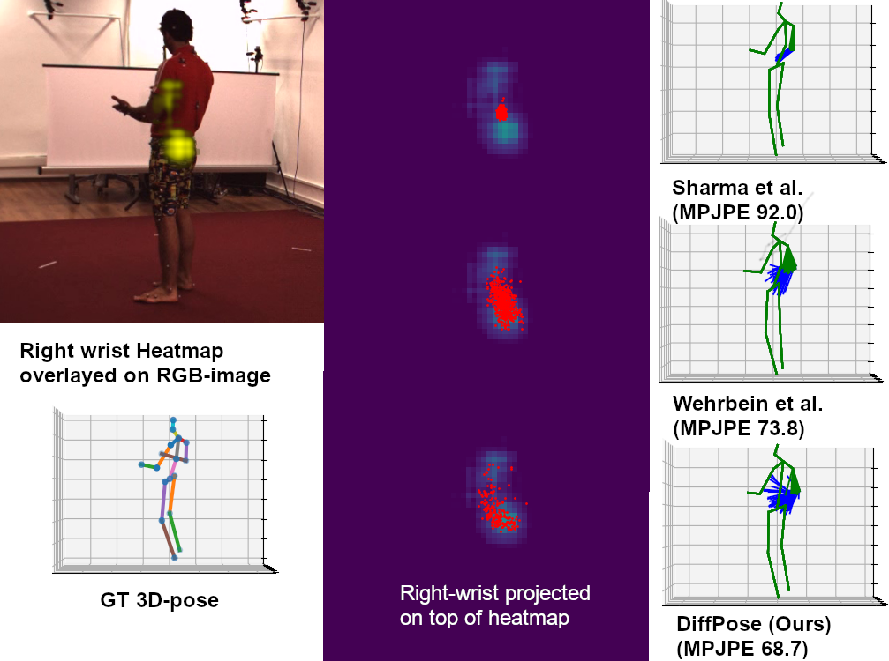

# DiffPose: Multi-hypothesis Human Pose Estimation using Diffusion Models (ICCV2023)
### Authors:
<a href="https://scholar.google.se/citations?user=Q2AY_q4AAAAJ&hl=sv&oi=ao">Karl Holmquist</a>

<a href="https://scholar.google.se/citations?user=z4aXEBYAAAAJ&hl=sv&oi=ao">Bastian Wandt</a>

<a href="https://openaccess.thecvf.com/content/ICCV2023/html/Holmquist_DiffPose_Multi-hypothesis_Human_Pose_Estimation_using_Diffusion_Models_ICCV_2023_paper.html">Paper</a>

## Overview:
This repository contains the code and some pre-trained models for our diffusion-based multi-hypothesis 3D human pose estimation method.


## Abstract:
Traditionally, monocular 3D human pose estimation employs a machine learning model to predict the most likely 3D pose for a given input image. 
However, a single image can be highly ambiguous and induces multiple plausible solutions for the 2D-3D lifting step, which results in overly confident 3D pose predictors. 
To this end, we propose DiffPose, a conditional diffusion model that predicts multiple hypotheses for a given input image. 
Compared to similar approaches, our diffusion model is straightforward and avoids intensive hyperparameter tuning, complex network structures, mode collapse, and unstable training.

Moreover, we tackle the problem of over-simplification of the intermediate representation of the common two-step approaches which first estimate a distribution of 2D joint locations via joint-wise heatmaps and consecutively use their maximum argument for the 3D pose estimation step. 
Since such a simplification of the heatmaps removes valid information about possibly correct, though labeled unlikely, joint locations, we propose to represent the heatmaps as a set of 2D joint candidate samples. 
To extract information about the original distribution from these samples, we introduce our embedding transformer which conditions the diffusion model. 

Experimentally, we show that DiffPose improves upon the state of the art for multi-hypothesis pose estimation by 3-5% for simple poses and outperforms it by a large margin for highly ambiguous poses.


</img>


### Paper:
Paper accepted for oral presentation at ICCV2023 in Paris and can be found here <a href="https://openaccess.thecvf.com/content/ICCV2023/html/Holmquist_DiffPose_Multi-hypothesis_Human_Pose_Estimation_using_Diffusion_Models_ICCV_2023_paper.html">DiffPose</a>


### Affiliation:
Computer Vision Laboratories (CVL) at Linköping University, Sweden


## Installation
We recommend creating a clean [conda](https://docs.conda.io/) environment. You can do this as follows:
```
conda env create -f environment.yml
```

After the installation is complete, you can activate the conda environment by running:
```
conda activate DiffPose
```

## Usage
Observer that some plotting functionalities can be limited without a wandb account, please use '--do_not_use_wandb' in this case.

### Training
Our main experiments can be trained using: 
```
python train.py --config diffpose.yaml --seed 42
```

For the other experiments their respective config files can be found at [experiments/iccv2023](experiments/iccv2023). And the used random seeds in [experiments/random_seeds.txt](experiments/random_seeds.txt)


### Evaluation
To evaluate the code separately from training: 
```
python eval.py --config diffpose.yaml
```

### Demo
We provide demo functionalities in the [demo folder](demo/inference.py) for running inference of a trained model on a given image. Observe that the images are scaled to 255x255, to improve performance, make sure that most of the images consists of the person in question and not background.
The 2D detector will also struggle if multiple persons are in the frame, leading to sub-optimal performance of our method.


## Pre-trained 2D detector
This repository contains both the fine-tuned network weights used by <a href="https://github.com/twehrbein/Probabilistic-Monocular-3D-Human-Pose-Estimation-with-Normalizing-Flows">Wehrbein et.al.</a>  and the non-finetuned weights it was based on from <a href="https://github.com/HRNet/HRNet-Human-Pose-Estimation">HRNet</a>.

The '--use_orig_hrnet' flag used when preprocessing the datasets, selects the non-finetuned weights when used.


## Datasets

### Human3.6m
We provide tools for preprocessing the Human3.6M dataset, creating both the full split and the harder set of ambiguous samples proposed by <a href="https://github.com/twehrbein/Probabilistic-Monocular-3D-Human-Pose-Estimation-with-Normalizing-Flows">Wehrbein et.al.</a> in data/preprocessing/H36M.py.

Please note that due to licensing of the original dataset we cannot provide you with the data, neither can we help with getting access to it excepting for directing you towards the official website: <a href="http://vision.imar.ro/human3.6m/description.php">Human 3.6M</a>

### MPI-INF-3DHP
Similarly, we provide preprocessing tools for <a href="https://vcai.mpi-inf.mpg.de/3dhp-dataset/">3DHP</a> in data/preprocessing/3DHP.py.


## Acknowledgements:
Thanks to this <a href="https://github.com/lucidrains/denoising-diffusion-pytorch">great repo</a> which served as a starting point for the implementation of the diffusion model used in this work.


